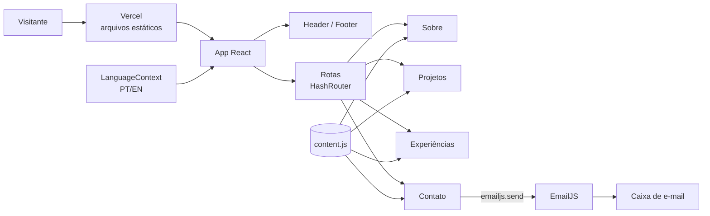

# 🏷️ Portfólio Profissional — Arthur Domingos 👨‍💻

> [!NOTE]
> Site de portfólio pessoal que reúne **formação, projetos, experiências e formas de contato** em um só lugar, em português e inglês.
> Desenvolvido no Laboratório 01 da disciplina de Desenvolvimento e Integração de Aplicações Web (PUC Minas, Engenharia de Software).

<table>
  <tr>
    <td width="800px">
      <div align="justify">
        Este projeto é uma <b>Single Page Application</b> feita com <b>React</b> e <b>Vite</b> que apresenta a trajetória profissional de Arthur Domingos. O site tem quatro páginas acessadas por um menu de navegação: <i>Sobre mim</i>, <i>Projetos</i> (linha do tempo), <i>Experiências</i> e <i>Contato</i>, com formulário que envia e-mail pelo <b>EmailJS</b>, sem back-end próprio. Todo o conteúdo fica em um único arquivo de dados, então dá para atualizar o portfólio sem mexer nos componentes. O site é responsivo e está publicado gratuitamente na <b>Vercel</b>.
      </div>
    </td>
    <td>
      <div>
        
      </div>
    </td>
  </tr>
</table>

---

## 🚧 Status do Projeto


---

## 📚 Índice
- [Links Úteis](#-links-úteis)
- [Sobre o Projeto](#-sobre-o-projeto)
- [Funcionalidades Principais](#-funcionalidades-principais)
- [Tecnologias Utilizadas](#-tecnologias-utilizadas)
- [Dependências](#-dependências)
- [Arquitetura](#-arquitetura)
- [Instalação e Execução](#-instalação-e-execução)
  - [Pré-requisitos](#pré-requisitos)
  - [Variáveis de Ambiente](#-variáveis-de-ambiente)
  - [Instalação de Dependências](#-instalação-de-dependências)
  - [Como Executar a Aplicação](#-como-executar-a-aplicação)
- [Deploy](#-deploy)
- [Estrutura de Pastas](#-estrutura-de-pastas)
- [Protótipos](#-protótipos)
- [Demonstração](#-demonstração)
- [Testes](#-testes)
- [Documentações utilizadas](#-documentações-utilizadas)
- [Autores](#-autores)
- [Contribuição](#-contribuição)
- [Agradecimentos](#-agradecimentos)
- [Licença](#-licença)

---

## 🔗 Links Úteis
* 🌐 **Demo Online:** [Acesse o portfólio](https://portfolio-rho-blond-nuvcwsmpx2.vercel.app)
  > 💻 Site em produção, hospedado na Vercel.
* 📁 **Repositório:** [github.com/thuzada/LAB1-DIW](https://github.com/thuzada/LAB1-DIW)

---

## 📝 Sobre o Projeto

- **Por que existe:** trabalho do Laboratório 01 de DIW, cujo objetivo é projetar, desenvolver e hospedar um portfólio profissional pessoal.
- **Qual problema resolve:** junta em um único link o que um recrutador ou colega precisa ver: quem eu sou, o que já construí, onde trabalhei e como falar comigo.
- **Contexto:** acadêmico (PUC Minas, Engenharia de Software, 2º período), mas pensado para uso profissional real.
- **Onde pode ser usado:** em currículos, no perfil do LinkedIn e do GitHub e em processos seletivos.

---

## ✨ Funcionalidades Principais

- 👤 **Sobre mim:** apresentação com formação, área de atuação, interesses e objetivos, exibida em português e inglês lado a lado, e lista de habilidades.
- 🗂️ **Projetos em linha do tempo:** ordenados por data, do mais antigo ao mais recente, com nome, descrição, tecnologias e link para o repositório no GitHub. Os projetos fixados no GitHub recebem o selo "Destaque".
- 💼 **Experiências:** estágios e trabalho, com instituição, cargo, período e descrição.
- 📨 **Contato:** ícones clicáveis para e-mail, WhatsApp, LinkedIn e GitHub, e formulário (nome, e-mail e mensagem) que envia e-mail pelo EmailJS.
- ✅ **Validação do formulário:** campos obrigatórios, formato de e-mail e tamanho mínimo da mensagem, com mensagens de erro no idioma atual.
- 🌐 **Internacionalização (PT/EN):** botão no menu que troca o idioma de todo o site. A escolha fica salva no navegador.
- 📱 **Layout responsivo:** menu recolhido em telas pequenas e grid adaptável.
- 🎞️ **Animações:** transições de entrada nas páginas e nos itens da timeline com Framer Motion.

---

## 🛠 Tecnologias Utilizadas

### 💻 Front-end

* **Biblioteca:** React 19
* **Linguagem:** JavaScript (ES2022+) com JSX
* **Roteamento:** React Router 7 (`HashRouter`)
* **Formulários:** React Hook Form
* **Estilização:** CSS puro com variáveis (custom properties), sem framework
* **Animações:** Framer Motion
* **Ícones:** React Icons
* **Gerenciamento de Estado:** Context API (idioma)
* **Build Tool:** Vite 8
* **Lint:** Oxlint

### 🖥️ Back-end

Não há back-end próprio. O envio de e-mail é feito direto do navegador pelo serviço **EmailJS**.

### ⚙️ Infraestrutura & DevOps

* **Cloud:** Vercel
* **Prototipação:** wireframes de média fidelidade (pasta `wireframes/`)
* **Versionamento:** Git e GitHub

---

## 📦 Dependências

| Pacote | Versão | Tipo | Para que serve |
| :--- | :--- | :--- | :--- |
| `react`, `react-dom` | 19.3.0 | produção | Interface |
| `react-router-dom` | 7.18.4 | produção | Navegação entre páginas |
| `react-hook-form` | 7.89.0 | produção | Formulário e validações |
| `@emailjs/browser` | 5.0.2 | produção | Envio de e-mail pelo front-end |
| `framer-motion` | 14.0.0 | produção | Animações |
| `react-icons` | 5.7.0 | produção | Ícones |
| `vite` | 8.3.3 | desenvolvimento | Build e servidor de desenvolvimento |
| `@vitejs/plugin-react` | 6.1.2 | desenvolvimento | Suporte a React/JSX no Vite |
| `oxlint` | 1.87.0 | desenvolvimento | Lint |
| `@types/react`, `@types/react-dom` | 19.x | desenvolvimento | Tipos para o editor |

---

## 🏗 Arquitetura

O projeto é uma **SPA estática**: o Vite gera HTML, CSS e JS em `dist/`, e a Vercel serve esses arquivos. Não existe servidor de aplicação nem banco de dados.

- **Conteúdo separado da interface:** textos, projetos, experiências, links e textos de interface ficam em `src/data/content.js`. As páginas apenas leem esses dados e renderizam. Para atualizar o portfólio, basta editar esse arquivo.
- **Layout único:** `App.jsx` monta cabeçalho, área de conteúdo (rotas) e rodapé. Cada página usa o componente `Section` para título, subtítulo e animação de entrada.
- **Idioma via Context API:** `LanguageContext` guarda o idioma atual (`pt`/`en`), salva a escolha no `localStorage` e atualiza o atributo `lang` do `<html>`. Os componentes usam o hook `useLang()`.
- **Timeline dinâmica:** a página de Projetos ordena os itens por data em tempo de execução, então um projeto novo entra na posição certa só de ser adicionado ao array.
- **E-mail sem back-end:** o formulário valida os dados com React Hook Form e chama `emailjs.send()` com as chaves lidas de variáveis de ambiente `VITE_*`.
- **Roteamento com `HashRouter`:** as URLs ficam como `/#/projetos`. Isso dispensa configuração de rewrite na hospedagem e evita erro 404 ao recarregar a página.



**Trade-offs:** sem back-end, as chaves do EmailJS ficam visíveis no bundle (são chaves públicas, e o EmailJS limita o envio por domínio e por cota). O conteúdo em arquivo JS exige um novo deploy para cada alteração, o que é aceitável para um portfólio pessoal.

---

## 🔧 Instalação e Execução

### Pré-requisitos

* **Node.js:** versão 20 ou superior
* **Gerenciador de pacotes:** npm
* **Conta no EmailJS** (opcional, só para o formulário enviar e-mails)

---

### 🔑 Variáveis de Ambiente

Crie um arquivo **`.env`** na raiz do projeto a partir do `.env.example`:

| Variável | Descrição | Exemplo |
| :--- | :--- | :--- |
| `VITE_EMAILJS_SERVICE_ID` | ID do serviço de e-mail cadastrado no EmailJS. | `service_xxxxxxx` |
| `VITE_EMAILJS_TEMPLATE_ID` | ID do template de e-mail. | `template_xxxxxxx` |
| `VITE_EMAILJS_PUBLIC_KEY` | Chave pública da conta EmailJS. | `xxxxxxxxxxxxxxxx` |

Para obter os valores: crie uma conta gratuita em [emailjs.com](https://www.emailjs.com/), cadastre um serviço de e-mail e crie um template a partir do modelo **"Contact Us"**. O site envia as variáveis `{{name}}`, `{{email}}`, `{{title}}` e `{{message}}`, que são as que esse modelo usa.

Sem essas variáveis o site funciona normalmente, mas o formulário avisa que o envio não está configurado.

---

### 📦 Instalação de Dependências

```bash
git clone https://github.com/thuzada/LAB1-DIW.git
cd LAB1-DIW
npm install
cp .env.example .env   # depois edite o .env com suas chaves
```

---

### ⚡ Como Executar a Aplicação

| Comando | O que faz |
| :--- | :--- |
| `npm run dev` | Servidor de desenvolvimento em http://localhost:5173 |
| `npm run build` | Gera a versão de produção em `dist/` |
| `npm run preview` | Serve o conteúdo de `dist/` localmente |
| `npm run lint` | Roda o Oxlint |

---

## 🚀 Deploy

O site está publicado na Vercel: **https://portfolio-rho-blond-nuvcwsmpx2.vercel.app**

Para publicar sua própria cópia:

1. Importe o repositório na [Vercel](https://vercel.com/new). O preset **Vite** é detectado automaticamente (build `npm run build`, saída `dist`).
2. Em **Settings > Environment Variables**, adicione as três variáveis `VITE_EMAILJS_*`.
3. Faça o deploy. Com o repositório conectado pela integração do GitHub, cada push na `main` gera um novo deploy e cada pull request ganha uma URL de preview.

Como o roteamento usa `HashRouter`, não é preciso configurar rewrites.

---

## 📂 Estrutura de Pastas

```
.
├── public/
│   └── favicon.svg              # ícone do site
├── src/
│   ├── components/
│   │   ├── Header.jsx           # menu de navegação + botão PT/EN
│   │   ├── Footer.jsx           # rodapé com links
│   │   ├── Section.jsx          # título/subtítulo + animação de entrada
│   │   └── ScrollToTop.jsx      # volta ao topo ao trocar de página
│   ├── context/
│   │   └── LanguageContext.jsx  # idioma atual (PT/EN) e textos de interface
│   ├── data/
│   │   └── content.js           # todo o conteúdo editável do portfólio
│   ├── pages/
│   │   ├── About.jsx            # Sobre mim
│   │   ├── Projects.jsx         # timeline de projetos
│   │   ├── Experience.jsx       # experiências
│   │   └── Contact.jsx          # ícones + formulário EmailJS
│   ├── App.jsx                  # layout e rotas
│   ├── main.jsx                 # ponto de entrada
│   └── index.css                # estilos globais e responsividade
├── wireframes/                  # protótipos desktop e mobile (PNG e SVG)
├── .env.example                 # modelo das variáveis de ambiente
├── .oxlintrc.json               # configuração do lint
├── index.html
├── package.json
└── vite.config.js
```

---

## 🎨 Protótipos

Wireframes de média fidelidade das quatro páginas, em desktop e mobile.

.png)

### Desktop

| Sobre | Projetos |
| :---: | :---: |
|  |  |
| **Experiências** | **Contato** |
|  |  |

### Mobile

| Sobre | Projetos | Experiências | Contato | Menu aberto |
| :---: | :---: | :---: | :---: | :---: |
|  |  |  |  |  |

---

## 🎥 Demonstração

Acesse a versão publicada: **https://portfolio-rho-blond-nuvcwsmpx2.vercel.app**

<!-- TODO: adicionar prints/GIFs do site publicado em docs/ e referenciá-los aqui, por exemplo:
| Sobre | Projetos | Contato |
| :---: | :---: | :---: |
|  |  |  |
-->

---

## 🧪 Testes

O projeto não tem testes automatizados. A qualidade é verificada com:

- `npm run lint` (Oxlint) para análise estática;
- `npm run build` para garantir que a versão de produção compila;
- testes manuais de navegação, troca de idioma, validação e envio do formulário, em desktop e mobile.

---

## 📖 Documentações utilizadas

* [React](https://react.dev/)
* [Vite](https://vite.dev/)
* [React Router](https://reactrouter.com/)
* [React Hook Form](https://react-hook-form.com/)
* [EmailJS](https://www.emailjs.com/docs/)
* [Framer Motion](https://www.framer.com/motion/)
* [React Icons](https://react-icons.github.io/react-icons/)
* [Vercel](https://vercel.com/docs)

---

## 👥 Autores

| Nome | GitHub | LinkedIn |
| :--- | :--- | :--- |
| Arthur Domingos | [@thuzada](https://github.com/thuzada) | [arthuraugust0](https://www.linkedin.com/in/arthuraugust0/) |

---

## 🤝 Contribuição

1. Faça um fork do repositório.
2. Crie uma branch: `git checkout -b feat/minha-melhoria`.
3. Faça commit das alterações: `git commit -m "feat: descreve a melhoria"`.
4. Envie a branch: `git push origin feat/minha-melhoria`.
5. Abra um Pull Request.

---

## 🙏 Agradecimentos

* Ao [Prof. Dr. João Paulo Aramuni](https://github.com/joaopauloaramuni), pela proposta do laboratório e pelo template de README.
* À PUC Minas, curso de Engenharia de Software.

---

## 📄 Licença

Projeto acadêmico, sem licença de uso definida. Todos os direitos reservados ao autor.
